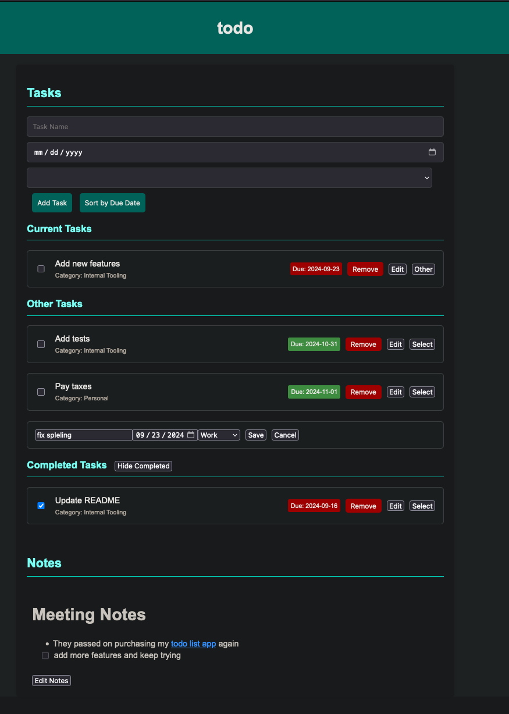
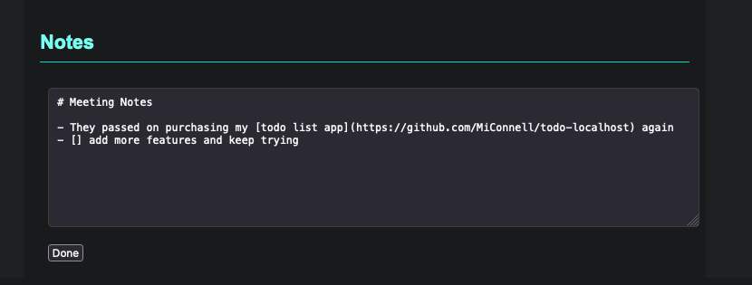
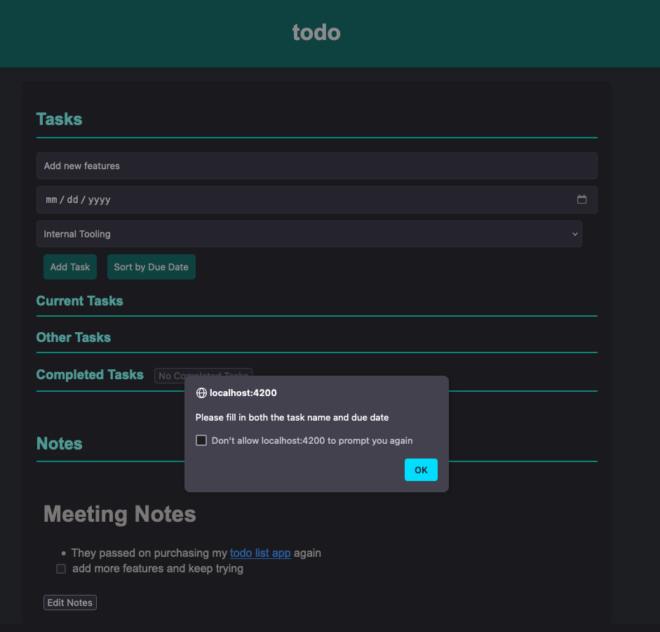

# Todo List with Notes

## Overview

This is a web-based **Todo List** application that allows users to:

- Add, edit, and remove tasks.
- Categorize tasks into **Current Tasks**, **Other Tasks**, and **Completed Tasks**.
- Automatically move tasks to **Completed Tasks** upon checking them, with the completion date recorded.
- Reorder tasks within each category.
- Markdown notes can also be added and rendered as formatted text.
- Persistent task data is stored in a `tasks.json` file to keep a record of task history.

## Features

- **Task Management**: Add, edit, remove, and categorize tasks.
- **Task Reordering**: Drag and drop tasks within lists to reorder them.
- **Completed Tasks**: Mark tasks as complete and automatically log their completion date.
- **Task History**: Tasks persist through page reloads and server restarts with a completion history.
- **Markdown Notes**: Add notes in Markdown format, which are rendered dynamically on the page.
- **Task Sorting**: Sort tasks by due date.

## Screenshots





## Technologies Used

- **Flask**: Backend server to serve the HTML page and manage tasks.
- **HTML/CSS/JavaScript**: Frontend for managing tasks and rendering notes.
- **JSON**: Storage for tasks with persistence across sessions.
- **YAML**: Storage for task categories.
- **Showdown.js**: A library for converting Markdown to HTML.
- **Docker**: Containerize the app for consistent environment and easy deployment.
- **Flexbox**: For clean, responsive task layout.

## Installation and Setup

### Prerequisites

- Python 3.x
- pip (Python package installer)

### Setup Instructions (Flask)

1. Clone the repository:

   ```bash
   git clone https://github.com/MiConnell/todo-list-with-notes.git
   cd todo-list-with-notes
   ```

2. Create a virtual environment (optional but recommended):

   ```bash
   python -m venv venv
   source venv/bin/activate  # On Windows: venv\Scripts\activate
   ```

3. Install the required Python packages:

   ```bash
   pip install -r requirements.txt
   ```

4. Start the Flask development server:

   ```bash
   python app.py
   ```

5. Open your web browser and go to `http://localhost:4200` to use the Todo List app.

### Docker Setup Instructions

1. Clone the repository:

   ```bash
   git clone https://github.com/MiConnell/todo-list-with-notes.git
   cd todo-list-with-notes
   ```

2. Build and start the containerized app with Docker Compose:

   ```bash
   docker-compose up --build .
   ```

This will create and start the container, exposing the app on port 4200. You can access the app in your browser at `http://localhost:4200`.

3. Stop the container:

```bash
docker-compose down
```

### File Structure

```bash
├── app.py # Main Flask backend
├── docker-compose.yml # Docker Compose configuration
├── Dockerfile # Docker configuration
├── LICENSE # License file
├── README.md # Documentation for the project
├── requirements.txt # Python dependencies
├── screenshot.png # Screenshot of the app
├── notes.md # Stores Markdown notes
├── data # Directory for persistent data
│ ├── tasks.json # Stores task data persistently
│ ├── categories.yaml # Stores task categories
│ └── notes.md # Stores markdown notes in Docker
├── static
│ ├── css
│ │ └── style.css # Styles for the app
│ ├── images
│ │ └── favicon.png # Favicon for the app
│ └── js
│ └── script.js # Frontend logic
├── templates
│ └── index.html # Main HTML page for the app

```

### JSON and YAML File Description

- `tasks.json`: Stores task data, including task names, due dates, categories, completion status, and completed date.
- `categories.yaml`: Stores task categories that can be selected when adding or editing tasks.

## How to Use

1. **Add a Task**:

   - Enter the task name, due date, and category, then click **Add Task**.
   - The task will appear in the **Other Tasks** list by default.

2. **Move a Task to Current Tasks**:

   - Click **Select** next to a task in **Other Tasks** to move it to **Current Tasks**.

3. **Complete a Task**:

   - Check the box next to a task. It will automatically move to the **Completed Tasks** section and record the completion date.

4. **View Completed Tasks**:

   - You can toggle the visibility of **Completed Tasks** using the **Show/Hide Completed** button.
   - Tasks will show the date they were completed next to their category.

5. **Edit a Task**:

   - Click **Edit** next to a task to change its details.
   - After making changes, click **Save** to update the task.

6. **Markdown Notes**:
   - Use the Markdown editor at the bottom of the page to add notes.
   - Click **Render Notes** to view the formatted Markdown below the editor.

## Contributing

Contributions are welcome! If you'd like to report issues or request new features, please create an issue or submit a pull request.

### Steps to Contribute:

1. Fork the repository.
2. Create a new branch:
   ```bash
   git checkout -b feature-new-task
   ```

````

3. Make your changes and commit:
   ```bash
   git commit -m "Add new task feature"
   ```
4. Push to your fork:
   ```bash
   git push origin feature-new-task
   ```
5. Create a pull request.

## Future Enhancements

- **Task Prioritization**: Add priority levels to tasks.
- **Notifications**: Send email or browser notifications for tasks close to their due date.
- **Search and Filter**: Add the ability to search for and filter tasks by category or due date.

## License

This project is licensed under the MIT License. See the `LICENSE` file for details.
````
